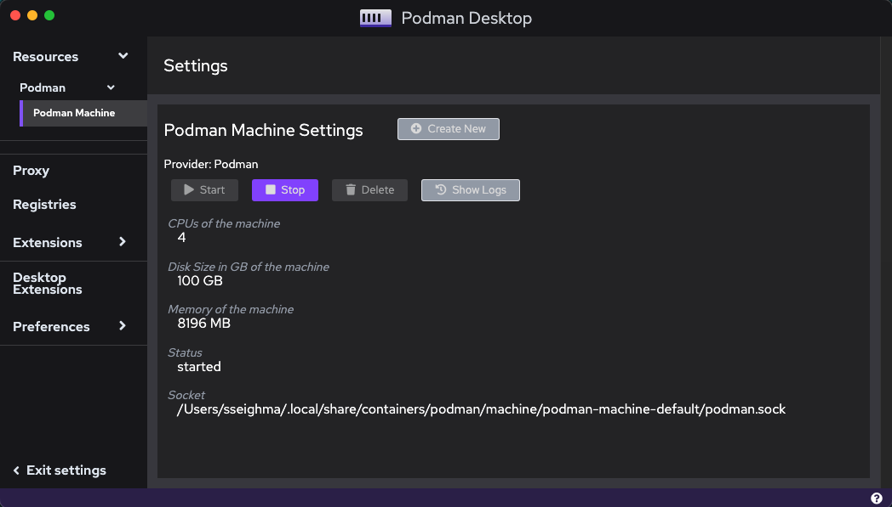
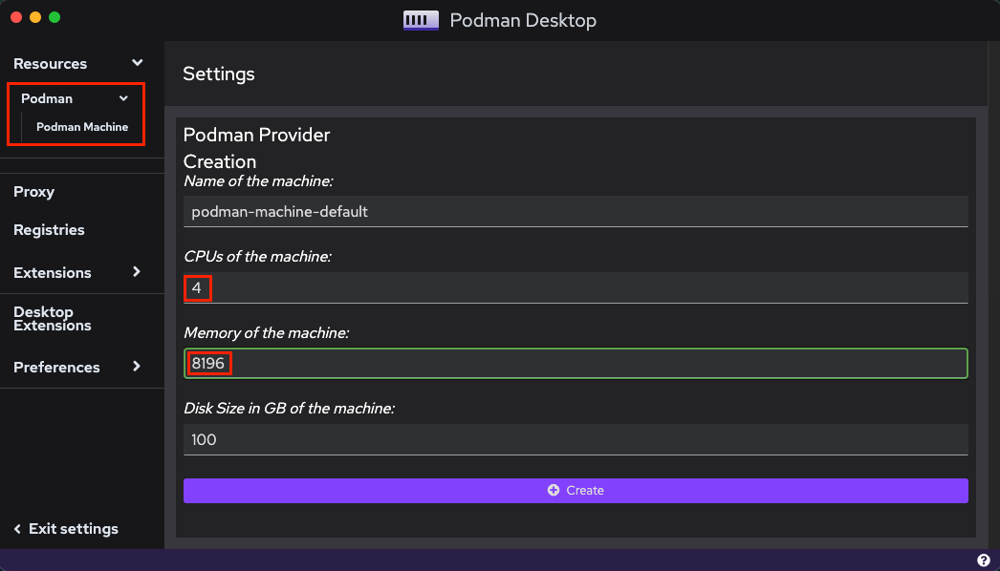

# Notes on Installing and Using podman

From the Podman site:

>*Podman is a daemonless container engine for developing, managing, and running OCI Containers on your Linux System. Containers can either be run as root or in rootless mode.*

You can also use `podman` on your Mac system too (see below).

#### Linux Installation

For `podman` to function properly, your distribution needs to support `cgroupsV2`.  You can check to determine if it's enabled:

```
$ sudo mount -l | grep cgroup
```
If `cgroupsv2` is mounted, you'll see results similar to the output below:
```
cgroup2 on /sys/fs/cgroup type cgroup2 (rw,nosuid,nodev,noexec,relatime,seclabel,nsdelegate)
```

If you're distribution does not have `cgroupsV2` enabled, you'll need to configure the boot kernel parameters to support it (or create another menu boot option).

```
$ sudo grubby --update-kernel=ALL --args="systemd.unified_cgroup_hierarchy=1"
```

Reboot the system to enable the change:
```
$ sudo reboot
```

To install `podman` on Oracle Linux 9, execute:

```
$ sudo dnf module install container-tools
```

>**NOTE:** On Oracle 8, use:
>```
>$ sudo dnf module install container-tools:ol8

For convenience, you may optionally install the `podman-docker` package that effectively aliases the `docker` command to `podman`. The installed package can help in environments where users are more familiar with Docker or where automation expects the docker command to be present.

To install the `podman-docker` package:

```
$ sudo dnf install podman-docker
```

In addition, if you have existing `docker-compose` files, the `podman-compose` package might be useful too (see below).

```
$ pip3 install podman-compose
```

#### Configuration

In my experience (with an Oracle Cloud Infrastructure instance), I had to edit the container configuration file to uncomment/set the PID parameter (to resolve `pid.max` errors at container run time).

The `containers.conf` file could reside in `/usr/share/containers/containers.conf`, `/etc/containers/containers.conf`, or `$HOME/.config/containers/containers.conf`.

In the `[containers]` section, find the `pids_limit` parameter and uncomment the line.  Next, change the value to `0`.

```
[containers]
pids_limit=0
```
This parameter sets the maximum number of processes allowed in a container, 0 indicates that no limit is imposed.

#### macOS Installation

Podman does not run natively on macOS because it was (originally) developed to manage Linux containers. On macOS, Podman interacts with the containers via a Linux VM. Homebrew is the most straightforward method to install packages for Podman.

```
$ brew install podman
==> Fetching dependencies for podman: capstone, pcre2, glib, bdw-gc, m4, libtool, pkg-config, guile, libtasn1, nettle, p11-kit, libevent, libnghttp2, unbound, gnutls, jpeg-turbo, libpng, libslirp, libssh, libusb, lzo, ncurses, pixman, snappy, vde, lz4, zstd and qemu
... <snip>
==> Installing podman
==> Pouring podman--4.3.1.monterey.bottle.tar.gz
==> Caveats
zsh completions have been installed to:
  /usr/local/share/zsh/site-functions

To restart podman after an upgrade:
  brew services restart podman
Or, if you don't want/need a background service you can just run:
  /usr/local/opt/podman/bin/podman system service --time=0
==> Summary
🍺  /usr/local/Cellar/podman/4.3.1: 185 files, 48MB
==> Running `brew cleanup podman`...
Disable this behaviour by setting HOMEBREW_NO_INSTALL_CLEANUP.
Hide these hints with HOMEBREW_NO_ENV_HINTS (see `man brew`).
==> Caveats
==> podman
zsh completions have been installed to:
  /usr/local/share/zsh/site-functions

To restart podman after an upgrade:
  brew services restart podman
Or, if you don't want/need a background service you can just run:
  /usr/local/opt/podman/bin/podman system service --time=0
```

>**NOTE:** If you encounter a permissions error (regarding `/usr/local/bin, /usr/local/lib`) during the installation, you'll need to adjust permissions on those directories:
>
>```
>$ sudo chown -R $(whoami) /usr/local/bin /usr/local/lib
>```

```
$ brew services restart podman
==> Tapping homebrew/services
Cloning into '/usr/local/Homebrew/Library/Taps/homebrew/homebrew-services'...
remote: Enumerating objects: 2243, done.
remote: Counting objects: 100% (114/114), done.
remote: Compressing objects: 100% (71/71), done.
remote: Total 2243 (delta 61), reused 53 (delta 43), pack-reused 2129
Receiving objects: 100% (2243/2243), 615.67 KiB | 3.97 MiB/s, done.
Resolving deltas: 100% (1008/1008), done.
Tapped 1 command (45 files, 774.5KB).
==> Successfully started `podman` (label: homebrew.mxcl.podman)
```

```
$ podman machine init
Downloading VM image: fedora-coreos-37.20221127.2.0-qemu.x86_64.qcow2.xz: done
Extracting compressed file
Image resized.
Machine init complete
To start your machine run:

	podman machine start
```

Based on experience, the recommendation is to increase the `podman machine` default cpu (1) and memory (2048 MB) settings to **4** and **8196 MB** respectively to accommodate native image executable builds.

```
$ podman machine set --cpus 4
$ podman machine set -m 8196
```
After you change the cpu/memory configs, start the `podman machine`:

```
$ podman machine start
Starting machine "podman-machine-default"
Waiting for VM ...
Mounting volume... /Users/sseighma:/Users/sseighma

This machine is currently configured in rootless mode. If your containers
require root permissions (e.g. ports < 1024), or if you run into compatibility
issues with non-podman clients, you can switch using the following command:

	podman machine set --rootful

API forwarding listening on: /Users/sseighma/.local/share/containers/podman/machine/podman-machine-default/podman.sock

The system helper service is not installed; the default Docker API socket
address can't be used by podman. If you would like to install it run the
following commands:

	sudo /usr/local/Cellar/podman/4.3.1/bin/podman-mac-helper install
	podman machine stop; podman machine start

You can still connect Docker API clients by setting DOCKER_HOST using the
following command in your terminal session:

	export DOCKER_HOST='unix:///Users/sseighma/.local/share/containers/podman/machine/podman-machine-default/podman.sock'
	
Machine "podman-machine-default" started successfully
```
You can verify the `podman machine` settings were implemented:

```
$ podman machine list
NAME                     VM TYPE     CREATED      LAST UP            CPUS        MEMORY      DISK SIZE
podman-machine-default*  qemu        2 hours ago  Currently running  4           8GB         107.4GB
```

The `docker` commands you have used in the past translate to `podman`, so you can continue to use those commands:

```
$ podman images
REPOSITORY  TAG         IMAGE ID    CREATED     SIZE
```

Lastly, you can also create an alias (in your `.zshrc` file) which effectively aliases the `docker` command to `podman`. The alias can help in environments where users are more familiar with Docker or where automation expects the `docker` command to be present:

```
alias docker='podman'
```

#### Optional

Podman Desktop is available to help manage your containers/pods, see link [here](https://podman-desktop.io/).

You can configure `podman` using the UI.

Stop the current `podman machine` by clicking on the stop button:



Click **Delete** to remove the existing machine.

Next, under **Podman**, create a new machine with **4 cpus** and **8GB of memory**.  Click on the **Create** button, then click on **Start** (be patient, it make take a while to start):

